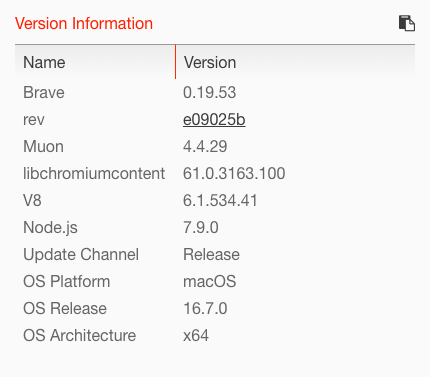

# UXSS-Vulnerabilities-Project
This project is carried by Antoine Rondelet and Ndeye Khady Ngom and ought to study and find UXSS vulnerabilities in the Brave Browser.

Here is the version of Brave we are using to carry out our project:

## Ideas to explore to try to find vulnerabilities:
*Legend:* :x: means that we tried but this was unsuccessful, :white_check_mark: means that we tried, and it worked.

- Tried to embed a website into an iFrame using XMLHttpRequest and tried to modify the headers of the request to try to modify the "Referer" and "User-Agent" headers and thus bypass the X-Frame-Options header of the "victim"/embedded website :x:

- Tried to add JS payload in the form of `testwebsite.com/test.pdf#<javascriptPayload>`
  - Without using any character escaping :x:
  - Using character escaping technics specified in https://www.owasp.org/index.php/XSS_Filter_Evasion_Cheat_Sheet :x:
  - Using "js-fuck" syntax (Javascript code written using only symbols) :x:

- Brave comes with some supported extensions. We should try to find if some vulnerabilities can be exploited in these extensions, and see if they can constitute a threat for the browser (like in https://events.ccc.de/congress/2006/Fahrplan/attachments/1158-Subverting_Ajax.pdf for instance) **--> TODO**

- Test whether it is possible to prevent Frame Busting scripts from working by doing variable clobbering (like in paper "Busting Frame Busting:
a Study of Clickjacking Vulnerabilities on Popular Sites") **--> TODO**

- Look at headers management on the code source of the browser and see if we can modify the "Referer" and/or the "User-Agent" **--> TODO**

- In the Brave code base, they escape "javascript" to avoid any javascript URL, using a non-case sensitive regex and an exact match on "javascript": Is there anything we can do to try to bypass such a regex ? Look into it
  - Already tried:
    - JAVASCRIPT :x:
    - JAVA%20SCRIPT :x:
    - %4A%41%56%41%53%43%52%49%50%54 (URL encoding of "JAVASCRIPT") :x:

- Embed a page with a X-Frame-Options: SAMEORIGIN header. Change the location of the current tab and block it directly via a javascript event, so that the parent's origin can match the origin of the website we try to embed, and abort the chnage of location instantaneously to stay on "malicious" page and have the good origin to bypass the SOP :x:
